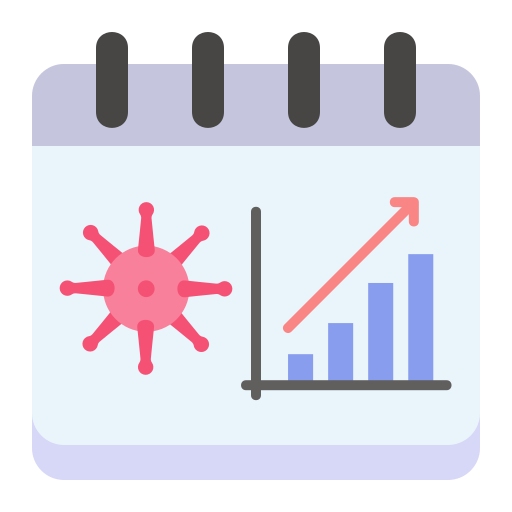

<div align="center">
  
</div>

<p align="center">
  <a href="#about">About</a>
   &nbsp;&nbsp;&nbsp;|&nbsp;&nbsp;&nbsp;
  <a href="#features">Features</a>
  &nbsp;&nbsp;&nbsp;|&nbsp;&nbsp;&nbsp;
  <a href="#run">Run</a>
   &nbsp;&nbsp;&nbsp;|&nbsp;&nbsp;&nbsp;
  <a href="#users">Users</a>
  &nbsp;&nbsp;&nbsp;|&nbsp;&nbsp;&nbsp;
  <a href="#license">License</a>
</p>

## About

COVID-19 infection monitor based [in](https://gisanddata.maps.arcgis.com/apps/opsdashboard/index.html#/bda7594740fd40299423467b48e9ecf6).

## Features

1. The system must have an admin user;

2. The system must have a model that will store COVID-19 data and a model that stores country names;

3. The system must have a simple 'CRUD' for COVID-19 data;

4. The data register must have a 'combo box' that carries the country model data;

5. Only the administrator user can register data in the COVID-19 table;

6. The data in the table must be identified on the main page, open and public to any user without the need for login;

7. A layout for a table should be created;

## Run

### Clone the repository

```bash
# Clone Repository
$ git clone https://github.com/PUC-DISCIPLINAS/monitorcoviddjango-gamoch-ianbandrade.git
```

### Run the Application

```bash
# Go to Application folder
$ cd monitorcoviddjango-gamoch-ianbandrade

# Run the Application
$ docker-compose up
```

Access the Application at <http://0.0.0.0:8000/>

## Users

In the app, we have two different types of users:

### Default

Default user can only view the list and select an country, to view their data.

### Admin

Admin user can modify the countries (CRUD), changing their data.

#### Default admin info

Username: `admin`

Password: `password`

## License

This project is under the MIT license. See the file [LICENSE](LICENSE) for more details.
